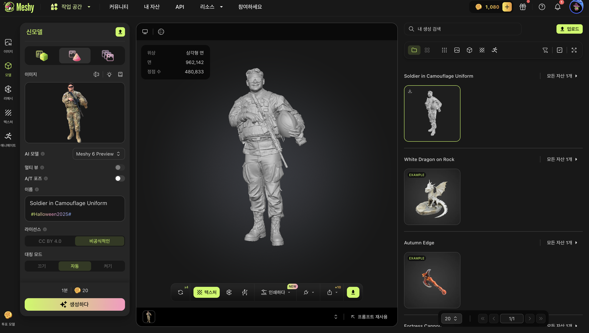

# AI 기반 아바타 생성 및 공격 게임 구현 (Unreal Engine 5.4.4)

## 프로젝트 개요
본 프로젝트는 **AI를 활용한 개인 아바타 생성과 언리얼엔진 기반 공격 게임 구현**을 목표로 한 Unreal Engine 5.4.4 프로젝트입니다.  
AI 모델링 도구인 **[Meshy.ai](https://www.meshy.ai/)** 를 사용해 실제 본인 사진으로부터  
3D 아바타를 자동 생성하고, 이를 언리얼 엔진 내에서 **걷기, 달리기, 스킬 공격 모션**이 가능한 캐릭터로 구현했습니다.  
또한, 게임 내 전투를 위해 별도의 **몬스터 모델과 스킬 모션**을 제작하여 게임 전투 구도를 완성했습니다.

---

## 주요 구현 내용

### AI 아바타 생성
- 실제 본인 사진을 입력으로 Meshy.ai를 활용하여 **AI 기반 3D 아바타 모델**을 생성  
- 얼굴의 대칭성과 윤곽선을 기반으로 본인과 유사한 Mesh 모델 자동 생성  
- 텍스처, 본 구조, 스켈레톤을 자동 생성하여 Unreal Engine 호환 FBX로 변환  

  
  &nbsp;&nbsp;&nbsp;&nbsp;
  

  <b>왼쪽:</b> 원본 사진 &nbsp;&nbsp;|&nbsp;&nbsp; <b>오른쪽:</b> Meshy.ai로 생성된 3D 아바타

---

### 아바타 애니메이션 제작
- 생성된 AI 아바타를 기반으로 **걷기, 뛰기, Skill1~Skill4** 등의 애니메이션을 제작  
- 아바타의 대칭 구조를 활용해 자연스러운 신체 움직임 구현  
- 각 스킬 모션은 캐릭터의 손동작, 자세 변화 중심으로 구성   

| 애니메이션 | 설명 | 이미지 |
|-------------|------|--------|
| Walk / Run | 기본 이동 모션 |  |
| Skill 1 | 공격 모션 |  |
| Skill 2 | 공격 모션 |  |
| Skill 3 | 공격 모션 |  |

---

### 몬스터 모델 및 스킬 모션
- 프롬프트로 생성한 FBX 몬스터 모델을 Unreal Engine에 임포트  
- 몬스터는 **수동 트리거 기반의 스킬 모션만 구현**

| 구분 | 설명 | 이미지 |
|------|------|--------|
| 프롬프트 | "눈이 하나인 흉측한 몬스터를 생성해줘" |
| AI 변환 결과 | Meshy.ai에서 생성된 3D 아바타 모델 |  |

| 구분 | 설명 | 이미지 |
|------|------|--------|
| 몬스터 모델 | 인게임 내 등장하는 몬스터 모습 |  |
| 몬스터 스킬 모션 | 몬스터의 공격 모션 장면 |  |

---

### Unreal Engine 통합 및 전투 구현
- 엔진 버전: **Unreal Engine 5.4.4**
- 캐릭터 클래스(`ACharacter` 상속)로 아바타 제어  
- AnimBlueprint를 통해 **상태 전이(State Machine)** 기반 애니메이션 제어  
- 몬스터는 별도 스켈레탈 메시를 사용하며, **플레이어의 스킬과 연동되는 전투 씬 구성**  
- 현재 프로젝트는 단일 전투 맵 기반의 **1인 플레이 프로토타입** 형태  

| 구분 | 설명 | 이미지 |
|------|------|--------|
| 게임 내 아바타 | Unreal Engine 상의 본인 아바타 모델 |  |
| 걷기 모션 장면 | 인게임에서의 캐릭터 이동 모습 |  |
| 캐릭터 스킬 장면 | 캐릭터가 스킬을 발동하는 인게임 전투 컷 |  |

---

## 기술 스택

| 분류 | 사용 기술 |
|------|-------------|
| **Game Engine** | Unreal Engine 5.4.4 |
| **3D Modeling AI** | Meshy.ai |
| **Language** | C++, Blueprint |
| **Animation** | AI Animation Generation / Unreal AnimBP |
| **VFX** | (미구현) — 향후 Niagara 기반 추가 예정 |
| **Assets** | AI 생성 아바타, 커스텀 몬스터 모델, 수동 제작 애니메이션 |

---

## 향후 개선 계획
- 스킬 모션에 **파티클 이펙트(Niagara)** 추가  
- 몬스터에 **AI 이동 및 전투 로직** 추가  
- 실시간 스킬 충돌 판정 및 HP 시스템 연동  
- 캐릭터 생성 및 외형 커스터마이징 메뉴 구현  

---

## 프로젝트를 통해 느낀 점
프로젝트를 통해 **AI와 게임 개발의 융합 가능성**을 직접 체감했습니다.  
기존에는 캐릭터 모델링, 리깅, 애니메이션 제작이 수작업 중심으로 진행되어 많은 시간이 소요되었지만,  
AI 기반 3D 모델링 도구를 활용함으로써 리소스 제작 효율이 크게 향상되었습니다.  

또한, 언리얼 엔진 내에서의 실제 전투 시스템 구현을 통해  
**AI가 콘텐츠 생성 도구를 넘어, 개발 파이프라인 자동화와 프로토타이핑 속도 향상에 기여할 수 있는 가능성** 또한 확인했습니다.  
앞으로는 **AI 기술을 개발 전반에 적극적으로 통합**하는 개발자로 발전하고자 합니다.

---

## 개발자 정보
**김문수 (Moonsu Kim)**  
- Sungkyunkwan University · Software Major  
- Contact: kimmail99@naver.com 

